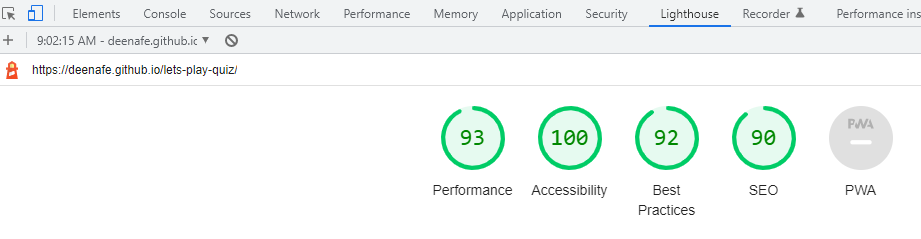

# LET'S PLAY QUIZ

## Table of Contents
1. [General Information](#General-information)
2. [Technologies](#Technologies)
3. [Testing](#Testing)
4. [Depolyment](#Depolyment)
5. [Credits](#Credits)
***

## General Information

**LET'S PLAY QUIZ** is an online Quiz Game with 10 questions that tests the user's knowledge in the areas of current affairs, science, sports and entertainment

***
### **Features**

### *Header and link* 

* The single page on the website contains the How to Play button, the site logo and link to my github page
* This will allow users to get information on features of the game by clicking the How to Play button

### *Favicon* 

* A favicon will be implemented with the logo image of the Quiz.
* This will provide an image in the the tabs header to allow the user to easily identify the website if they have multiple tabs open.

### *Game Instructions* 

* The Game Features can be accessed by clicking the How to Play button on the page header.
* On clicking the How to Play button, a window pops up containing information and general rules of the game.
* To close the pop up window, the user will click the Close button on the pop up.

### *Start Quiz Button* 

* A button on the home page invites the user to click to start the quiz.
* Clicking the button will display the Quiz questions.

### *Quiz questions*

* The quiz questions comprises of 10 question with each question having 4 answer options.
* Only one answer can be selected for each question. An answer is selected by clicking on a button that comes before the answer.
* When an answer is selected, the outline of the question and corresponding answers group will highlight with a thicker border.

### *Submit button*

* Upon clicking the submit button, a function checks to ensure that all questions were answered.
* The submit button also prompts validation that all questions were answered before checking for correct answers. If all questions are not answered, the user gets an alert on the screen with the following message "Please select at least one answer for each question".
* If all questions are answered, then the answers selected by the user will be checked to determine which questions were answered correctly. 
* Based on the number of correct answers, the score obtained by the user will be displayed in a pop up along with an image.

### *Score Area*

* This displays the a score between 0-10 depending on the number of question the user answers correctly.
* Depending on the score obtained by the user, a gif image and message is displayed.
* To close the pop up and return to the home page, the user can click the Restart Quiz button.

## Technologies  
*** 

**HTML**
   * The structure of the web pages was done using html. 

**CSS**
   * The decorative features of the web pages was done using CSS in an external file.

**Javascript**
   * The quiz form logic was done using Javascript in an external file.

**Visual Studio Code**
   * The website was developed using Visual Studio Code IDE

**Gitpod Workpspace**
  *  Used to commit and push code during the development of the Website.

**GitHub**
  *  Code is hosted and deployed on GitHub.

  **Favicon.io**
  *  Favicon files were created at https://favicon.io/favicon-converter/

  ***
## Testing   

***

   ### Responsiveness
The Home page and pop ups were tested for responsiveness using Chrome Developer tools on various device screen sizes ranging from 280px.

The design features was consistent when tested on Chrome, Mozilla Firefox, Opera and Edge browsers.

All pages of the website were responsive when tested on the following devices using Chrome Developer tools.:

1. iPhone Se
2. iPhone 12
3. Samsung Gakaxy 8+
4. iPad Air
5. iPad Mini
6. Galaxy Fold
7. Samsung Galaxy A51

The responsive design features was also consistent when the website was manually opened on the following IOS and Andriod devices:

1. iPhone X 
2. Samsung Galaxy A21s
3. Huawei Honor 8

###  Accessibility  

 [Wave](https://wave.webaim.org/) was used to evaluate the accessibility of the deployed site to ensure the website meets the WCAG Web Accessibilty Standards. The results of the accessibility testing showed that the following were met:

  * There were no color contrast errors in all the pages.
  * Image alternative text is present to give information on the content or function of an image to screen reader users.
  * All fieldsets have legends to provide a description to group of radio buttons.
  * Form labels are present and associated with a form control.
  * The HTML lang atrribute is present to allow screen readers to read the content appropriately.
  

*I was short on time and could not proceed with conducting manual testing. I already downloaded a free screen reader and hope to conduct the manual accessibility testing at a later date.*

###  Navigation Link

 * Testing was performed to ensure the GitHub link on the header opened my github profile in a new tab. This was done by clicking the link with the Github icon.

 * Deen Afe's Github profile opened in a new tab.

 ###  Buttons

 * The quiz has 5 buttons which are:
 
 1. How to Play
 2. Close (for the How to Play pop up)
 3. Start Quiz
 4. Submit 
 5. Restart Quiz

 All buttons function as the should and respond to click events by the user.

  ###  Confirm Answers

The logic for checking the correct answers was was done by declaring a variable and assigning it a number value of 0.

The selected answers is compared to the correct answer, and if it returns true for each, the score increments by 1. The logic used is as follows:

let correct = 0

* if (question1[1].checked === true) {
        correct++;
    }
*    if (question2[3].checked === true) {
        correct++;
    }
*    if (question3[1].checked === true) {
        correct++;
    }
*    if (question4[2].checked === true) {
        correct++;
    }
*    if (question5[0].checked === true) {
        correct++;
    }
*    if (question6[0].checked === true) {
        correct++;
    }
*    if (question7[3].checked === true) {
        correct++;
    }
*    if (question8[0].checked === true) {
        correct++;
    }
*    if (question9[0].checked=== true) {
        correct++;
    }
*    if (question10[1].checked === true) {
        correct++; }

###  Lighthouse Testing

## Validator Testing   

*HTML*
* No errors were returned when passing through the official [W3C validator](https://validator.w3.org/)

*CSS*
* No errors were found when passing through the official [(Jigsaw) validator](https://jigsaw.w3.org/css-validator/)

*Javascript*
* Five errors for missing semi colon was returned when passing the code through [JSHint validator](https://jshint.com/)
* My attempt to add the missing semi colon to the referenced linesm caused errors to display on my Vs Code editor and for want of time, I could not go through the lines of code to fix it

## Identified Bugs

* I had issues with the javascript code for my form validation. The code was meant to ensure that all questions are answered before is submitted to check correct answers. I could not resolve this bug due to time constraints and had to remove the validate function to enable me submit my project on before deadline. I hope to go back to resolve the validate function at a later time.

* I have some whitespace on mobile devices below 600px. In my efforts to resolves this I set the overflow of the body and html elements to hidden. I aslo attempted to remove all margins and padding from the page elements but that did not fix it, so I also intend to look into how to fix this at a later date.

* As mentiuoned on my Javascript validation testing, I got 5 warnings for missing semi colon but adding the semi colon to the code of template literal strings brings up an error on my code editor. I intend to attend to this at a later date to enable me submit the project.

* I also niticed that the favicon which I added only works on my "Ports View" page but doesn't work on my deployed page. For lack of time, I am unable to look into this.

## Deployment 
***

### Github Pages

**The site was deployed to GitHub pages. The steps to deploy are as follows:**

* In the GitHub repository, navigate to the Settings tab
* From the menu on left select 'Pages'
* Click 'Save'
* The live link will be found with the message "Your site is live at" -  https://deenafe.github.io/lets-play-quiz/

### Clone the Repository Code Locally  

**Navigate to the GitHub Repository you want to clone to use locally:**

* Click on the code drop down button
* Click on HTTPS
* Copy the repository link to the clipboard
* Open your IDE of choice (git must be installed for the next steps)
* Type git clone copied-git-url into the IDE terminal

***
## Credits  
***

### Content  

*  The idea for the creation of the museum is from the EMOWAA Trust headed by Phillip Ihenacho.
  
*  The code for the How to play popup guide was tailored after [Youtube Tutorial video by "Easy Tutorials"](https://www.youtube.com/watch?v=AF6vGYIyV8M).

*  The code to get increment correct answers was gotten from a [Youtube Tutorial video by "Kevin Briggs"](https://www.youtube.com/channel/UCeebzVOg5Iv4hVqKTFdaqUQ).

*  The code to to display selected radio values was gotten from a [Geeks for Geeks"](https://www.geeksforgeeks.org/how-to-get-value-of-selected-radio-button-using-javascript/#:~:text=To%20get%20the%20value%20of,is%20selected%20and%20False%20otherwise).

### Media   

*  The page logo is from [Google Image search](https://www.google.com/search?q=quiz+logo&hl=en-GB&source=lnms&tbm=isch&sa=X&ved=2ahUKEwjN8-qvvNX6AhUL3qQKHdEcD0MQ_AUoAXoECAEQAw&biw=1366&bih=600&dpr=1).  

 * The GIF images for the score display was from [Gighy](https://giphy.com/).  

